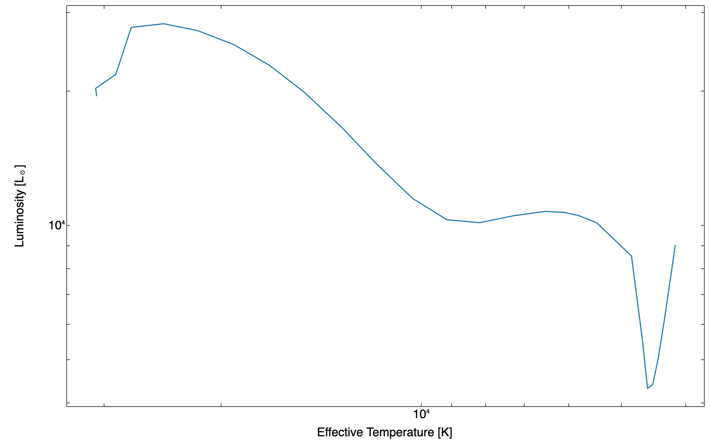
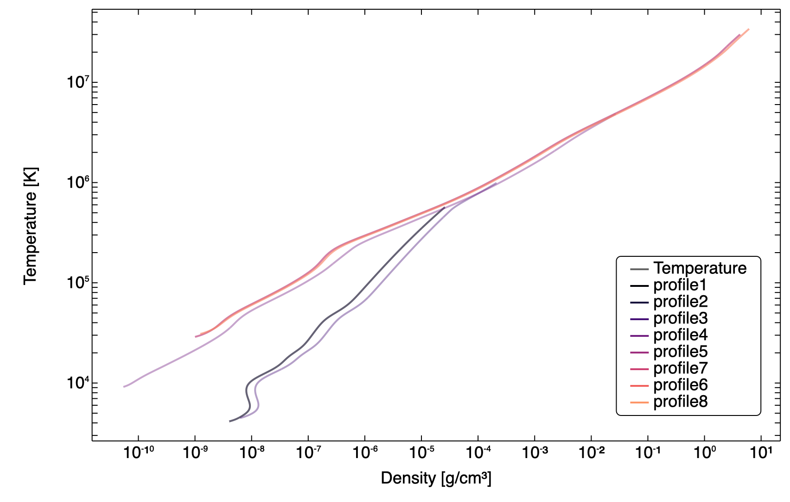

import { Aside, FileTree } from '@astrojs/starlight/components';
import { Image } from 'astro:assets';
import LearningObjective from '../../../components/LearningObjective.astro';
import Task from '../../../components/Task.astro';
import Hint from '../../../components/Hint.astro';
import Answer from '../../../components/Answer.astro';
import SideBySideImages from '../../../components/SideBySideImages.astro';
export const tutorialNumber = frontmatter.tutorialNumber;

import mesa_explorer_hr from '../../../assets/tutorial-3-HR.png';


You've run your first MESA simulation. Now we'll get to work understanding the outputs of that simulation and how to control MESA with inlists to create our own custom simulations.

### Results of a MESA Run

We ran a MESA simulation, but what do we have to show for it? Several types of files have been generated.

#### Saved Model
In the main directory, it should have created a new file called `15M_at_TAMS.mod`. This is a **MESA model** file, and we could use it as a starting point for a new simulation. MESA model files have the bare minimum information needed to describe a stellar model, and are portable across different MESA releases. This particular model file has a pretty poor name, as the model we just ran stopped at the zero-age main sequence (ZAMS) and not at the terminal-age main sequence (TAMS). Whoops! We'll fix that in just a moment.

#### Photos and Restarting
Two other folders are also now full of new files. First, we'll look at the `photos` folder.

<Task title="Explore the `photos` directory" number={1} tutorialNumber={tutorialNumber}>
  Use `ls` to list the contents of the `photos` directory. 
</Task>
<Answer>
  Execute
  ```bash
  ls photos
  ```
  You should see the following files:
  ```
  x050 x100 x150 x200 x207
  ```
</Answer>

These "photos" are binary files that contain the exact state of the star at various model numbers. In this case, photos were saved every 50 timesteps and then one more at the very end. Photos have one purpose: for restarting a simulation rather than starting from scratch.

We've already encountered two executable files in the work directory: `mk` (compiles the project) and `rn` (runs the compiled project). There is a third called `re`, which allows us to restart a simluation from a photo. When given an argument (one of the files in the `photos` directory, though you do not have to put `photos/` in front of it), it will restart the simulation from that photo. when not given any argument, it will restart from the most recent photo. Let's give this a try.
<Task title="Restart the simulation from a photo" number={2} tutorialNumber={tutorialNumber}>
  Restart from the photo corresponding to model number 100.
</Task>
<Answer>
  Execute the following command:
  ```bash
  ./re x100
  ```
  This will restart the simulation from model number 100, which is about halfway through the simulation. You should see the same output as before, but now the simulation will start from model number 100 and continue until it reaches the end of the simulation.
</Answer>

Restarting from photos is useful for debugging, as it lets you skip early parts of the simulation that you know are working correctly. However, storing photos can take up a lot of disk space, especially for high-resolution simulations with many time steps. For this reason, MESA will overwrite photos every 1000 timesteps. This is why the photo names start with "x"; `x050` could be for model 50, model 1050, model 2050, etc. By default, MESA will always keep a photo for every thousandth model, but many of these behaviors can be customized.

<Aside title="Why photos AND models?">
Why do we have both photos and models? Photos are binary (not human-readable) files for <em>short-term</em> usage. They are only useful for restarting a simulation using the exact same MESA installation and basically nothing else. It's pointless to share photos across different MESA installations.

Models, on the other hand, are for <em>long-term</em> usage and are human readable. In fact, with some effort, you can probably map a MESA model file into a format readable for other stellar evolution codes. They are also portable across different MESA installations, so they are much more useful with sharing or persisting after an upgrade to MESA.

It's possible that in the future, MESA will unify these two using a more efficient compression format, but for now, we have both.
</Aside>

<LearningObjective statement="restart a MESA simulation from a photo" number={1} tutorialNumber={tutorialNumber} />

<LearningObjective statement="explain the purpose of and differences between photos and models" number={2} tutorialNumber={tutorialNumber} />

#### The `LOGS` Directory
There's one more directory that our simulation has influenced: the `LOGS` directory.

<Task title="Explore the `LOGS` directory" number={3} tutorialNumber={tutorialNumber}>
  Use `ls` to list the contents of the `LOGS` directory.
</Task>
<Answer>
  Execute
  ```bash
  ls LOGS
  ```
  You should see the following files:
  ```
  history.data   profile1.data  profile3.data  profile5.data  profile7.data  profiles.index
pgstar.dat     profile2.data  profile4.data  profile6.data  profile8.data
  ```
</Answer>
These files are the main output of a MESA simulation. The `history.data` is the **history** output file, which contains one line for each timestep in the simulation, with each column corresponding to a different quantity. Each quantity in these columns is a *scalar* quantity, like the photospheric luminosity, total mass, or central hydrogen abundance.

**Profiles**, like `profile1.data`, contains data representing the full structure of the stellar model at a given timestep. Like photos, there is a balance to be struck between number of saved profiles and disk space. Additionally, there is a finite number of profiles that will be saved, at which point older, low-priority ones will be overwritten. Unlike photos, though, the numbers attached to the files are usually not the model numbers associated with them. That's where the `profiles.index` file comes in. It contains a few columns that relate the profile number (the number after `profile` in the file name) to the model number (time step) and the priority of the profile (how "important" MESA thinks it is when it needs to determine which profiles to overwrite). History and profile files are the main output you'll use to analyze your MESA simulations after they are complete, and we'll talk about working with them in more detail in a later tutorial.
<Aside title="What about `pgstar.dat`?">
  This is a *binary* file that is used by `pgstar`, particularly for history files. You won't interact with it directly, so it's best to just leave it alone.
</Aside>

Histories, profiles, and profile indexes are just text files, so you can open them in any text editor or general programming language. However, many tools have been developed to help you work with these files. For now, I'll introduce a simple web-based tool that I also happen to be the developer of: [MESA Explorer](https://billwolf.space/mesa-explorer/). This tool allows you to upload history and profile files and visualize them with simple scatter plots that you can then download as PNG or SVG files. It's probably not going to meet all of your needs for research work, but for quick analysis or education, it's a great tool. Let's take it for a spin.

<Task title="Visualize a MESA history file with MESA Explorer" number={4} tutorialNumber={tutorialNumber}>
  Go to <a href="https://billwolf.space/mesa-explorer/" target='_blank'>MESA Explorer</a> and upload the `LOGS/history.data` file from your work directory. Make a theorist's HR diagram (luminosity vs. effective temperature) and save it as a PNG file.
</Task>
<Hint title="Using MESA Explorer">
    Look at the instructions on the page, for the details, but you will need to upload the history file, then select the columns you want to plot against each other (I recommend using the search fields to speed things up), adjust the x-axis limits (remember, blue star are to the left and red stars to the right), and then save the plot as a PNG file.
    </Hint>
<Hint title="Getting the x-axis right">
    Remember that in an HR diagram, the x-axis is effective temperature, but it goes from high values on the left (hot, blue stars) to low values on the right (cool, red stars). MESA Explorer is pretty clever, but at the time of this writing, it doesn't know to flip the x-axis for you. There's an easy way to do this, though: In the x-axis controls, click the chevron next to "Axis Settings" and click the box with left and right arrows to flip the axis limits.
    </Hint>
<Answer>
    You should end up with a plot that looks something like this:
    
    If you couldn't make this, see the hints above for help, and if you still can't figure it out, don't worry; you don't *have* to use MESA Explorer; it's just one simple tool that doesn't require much prior knowledge.
    </Answer>

Before returning to the work directory structure, let's get some more practice working with profiles and MESA Explorer.
<Task title="Visualize a MESA profile file with MESA Explorer" number={5} tutorialNumber={tutorialNumber}>
  Go back to <a href="https://billwolf.space/mesa-explorer/" target='_blank'>MESA Explorer</a> (you can even use the window you were just using for the history plot) and upload *all* of the profiles in the `LOGS` directory from your work directory. Ensure that "multi-file" mode is on and select all of the profiles for plotting (once you select one, the "select all" toggle makes this easy). Make a scatter plot of the temperature vs. density. You should then see a series of curves showing how the temperature-density profile changes as it approaches the main sequence.
  </Task>
  <Hint title="Resetting the x-axis">
  If you still have the x-axis inverted from the previous task, use the same button to flip it back to "normal" (high densities to the right and low densities to the left).
  </Hint>
  <Hint title="Adjusting Styles">
  With eight profiles being visualized at once, the plot gets pretty busy! If you press the "Style Controls" button, you can change the opacity, line width, and color schemes. For instance, picking the magma color scheme will create a clear progression from early to late times, since MESA Explorer automatically sorts profiles in order of model number. Setting the opacity to 0.5 will make it easier to see the curves that overlap.
  </Hint>
  <Hint title="Legend in the Way?">
  If the legend is in the way, you can simply click and drag it to a different location. You can also customize the names of series in the legend by changing the names of files in the file selector panel.
  </Hint>
  <Answer>
  After uploading all eight profiles, selecting multi-file mode, and then selecting all profiles to be plotted, I selected `logRho` as the x-axis quantity and `logT` as the y-axis quantity. I then also changed the color scheme to "magma" and set the default opacity to 0.4. The resulting plot should look something like this:
  
  Note: switching to single file mode will allow you to toggle which profile you are plotting by using the up and down arrow keys. This is great for quickly comparing profiles in an almost animated way, though I recommend fixing the axis limits in the axis settings to make it easier to see what's actually changing.
  </Answer>

## Structure of a work directory
Okay, you've run your first MESA simulation and learned a bit about the main types of output it produced, but now it's time to look at the structure of your work directory a little bit more closely. Don't worry, though, we've already seen a lot of the important files and directories.

<Task title="Explore the structure of a MESA work directory" number={6} tutorialNumber={tutorialNumber}>
  If you haven't done this already, use `ls --color=auto` to list the contents of your work directory.
</Task>

You should see the following files and directories:
<FileTree>
- clean
- inlist
- inlist_pgstar
- inlist_project
- LOGS/
- make/
  - makefile
- mk
- photos/
- re
- README.rst
- rn
- src/
  - run.f90
  - run_star_extras.f90
- star
</FileTree>

First, let's talk over the executables in this directory:
### Executables
After compiling, there should be five executables in your work directory; you've already used three of them:
- `mk`: compiles the MESA code in your work directory. You need to use this the first time you create a work directory, and then again any time you make a change to **Fortran code** in your work directory. This usually means when you mak echanges to `src/run_star_extras.f90`.
- `star` the main MESA executable. It reads data from the `inlist` file (more on that soon) and runs the simulation. You can run this directly, but it's usually better to use `rn` instead.
- `rn`: does some housekeeping and then runs the `star` executable. Sometimes this includes some additonal logic, especially if there are multiple steps to a simulation, like running multiple inlists in succession.
- `clean`: cleans up the work directory by removing all compiled files and other temporary files. Particularly useful when you updgrade MESA or copy/move a work directory to a new computer. When you se strange errors, it's often a good idea to run `./clean` and then `./mk` to recompile everything.
- `re`: restarts a simulation froma photo file. If you run this without any arguments, it will restart from the most recent photo. If you give it a photo file name as an argument, it will restart from that photo. For example, `./re x100` will restart from the photo file `photos/x100`.

### Inlists
Inlists are the main way to control a MESA simulation. As I mentioned when I told you about the `defaults` directory, an inlist is a file that consists of key-value pairs that set parameters for a MESA simulation.

When a MESA simulation starts, it searches for a file called `inlist` and reads that file. Let's take a look at what's inside.

<Task title="Open the `inlist` file" number={15} tutorialNumber={tutorialNumber}>
  Open the `inlist` file in your favorite text editor.
</Task>
<Answer>
  If you are in your work directory, you can open the `inlist` file in VS Code with the following command:
  ```bash
  code inlist
  ```
  Of course, you don't have to use VS Code. You could replace `code` with a command-line eidtor like `nano`, `vim`, or `emacs`, or use some other graphical editor like Sublime Text or gedit. The important thing is that you open the `inlist` file in a text editor so you can read it.
</Answer>
The `inlist` file should look something like this:
```fortran title="inlist"
! This is the first inlist file that MESA reads when it starts.

! This file tells MESA to go look elsewhere for its configuration
! info. This makes changing between different inlists easier, by
! allowing you to easily change the name of the file that gets read.

&star_job

    read_extra_star_job_inlist(1) = .true.
    extra_star_job_inlist_name(1) = 'inlist_project'

/ ! end of star_job namelist


&eos

    read_extra_eos_inlist(1) = .true.
    extra_eos_inlist_name(1) = 'inlist_project'

/ ! end of eos namelist


&kap

    read_extra_kap_inlist(1) = .true.
    extra_kap_inlist_name(1) = 'inlist_project'

/ ! end of kap namelist


&controls

    read_extra_controls_inlist(1) = .true.
    extra_controls_inlist_name(1) = 'inlist_project'

/ ! end of controls namelist


&pgstar

    read_extra_pgstar_inlist(1) = .true.
    extra_pgstar_inlist_name(1) = 'inlist_pgstar'

/ ! end of pgstar namelist
```